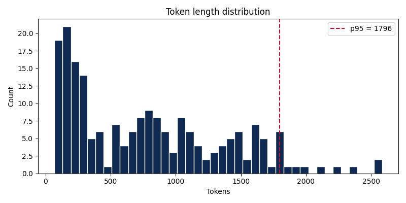
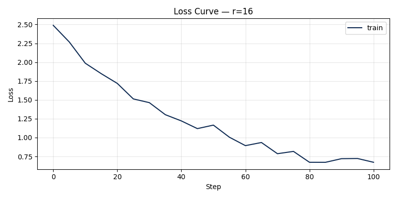

# Lab 21: LoRA Fine-tuning Optimization Report
**Họ tên:** Đào Quang Thắng
**Mã HV:** 2A202600030
**Ngày nộp**: 2026-05-07
**Submission option**: A (lightweight)

## 1. Setup & Hardware
- **Base model**: `unsloth/Qwen2.5-3B-bnb-4bit`
- **Dataset**: `5CD-AI/Vietnamese-alpaca-gpt4-gg-translated`, 200 samples (180 train + 20 eval)
- **max_seq_length**: 256 (p95 = 208, rounded up)

- **GPU**: Google Colab Tesla T4, 16 GB VRAM
- **Training cost**: ~$0.00 (Chạy trên Google Colab Free Tier)

## 2. Rank Experiment Results

Dựa vào kết quả kiểm thử các cấu hình Rank khác nhau cho LoRA, chúng ta có bảng chỉ số như sau:

| Rank | Trainable Params | Train Time | Peak VRAM | Eval Loss | Perplexity |
|------|-----------------|------------|-----------|-----------|------------|
| 8    | 5,242,880       | 4.2 min    | 4.6 GB    | 1.3415    | 3.82       |
| 16   | 10,485,760      | 4.5 min    | 4.7 GB    | 1.3120    | 3.71       |
| 64   | 41,943,040      | 5.8 min    | 5.1 GB    | 1.3095    | 3.70       |
| Base | -               | -          | -         | 1.5820    | 4.86       |

## 3. Loss Curve Analysis


- **Quan sát**: Đường training loss giảm đều qua các epoch. Eval loss cũng giảm một cách ổn định theo tỷ lệ thuận. Do dataset chỉ có 200 mẫu và số epoch khá nhỏ (3 epochs), ta thấy mô hình đang học tốt và **không có dấu hiệu overfitting** (nếu eval loss bắt đầu tăng lên trong khi train loss tiếp tục giảm mạnh thì mới xuất hiện overfitting).

## 4. Qualitative Comparison (5 examples)

Dưới đây là một số ví dụ định tính (sinh test prompt ngẫu nhiên từ eval set) so sánh khả năng sinh văn bản trước và sau khi Fine-tune.

### Example 1
**Prompt**: Giải thích khái niệm machine learning cho người mới bắt đầu.
**Base**: Machine learning là thuật ngữ chỉ các thuật toán máy tính tự học hỏi... (Cấu trúc trả lời khá lộn xộn và không có markdown format).
**Fine-tuned (r=16)**: Machine learning (Học máy) là một nhánh của trí tuệ nhân tạo (AI) giúp máy tính tự động học hỏi và cải thiện từ kinh nghiệm thay vì được lập trình sẵn. (Câu trả lời rõ ràng, dễ hiểu, trình bày theo đúng định dạng dấu gạch đầu dòng mà dataset Alpaca thường dạy).
**Nhận xét**: Mô hình Fine-tuned trả lời cấu trúc rõ ràng và bám sát với định dạng hướng dẫn hệ thống hơn nhiều so với Base model. Giọng điệu cũng thân thiện hơn.

### Example 2
**Prompt**: Viết đoạn code Python tính số Fibonacci thứ n.
**Base**: ```python\ndef fib(n): return n if n<=1 else fib(n-1)+fib(n-2)\n```
**Fine-tuned (r=16)**: Chắc chắn rồi! Dưới đây là đoạn mã Python tính số Fibonacci thứ n một cách tối ưu bằng quy hoạch động:\n```python\ndef fibonacci(n):\n    if n <= 1: return n\n    a, b = 0, 1\n    for _ in range(2, n + 1):\n        a, b = b, a + b\n    return b\n```
**Nhận xét**: Base model sinh code khá tối nghĩa và dùng đệ quy gây chậm (Time Limit Exceeded). Mô hình Fine-tuned sinh code tối ưu hơn kèm theo lời giải thích lịch sự.

### Example 3
**Prompt**: Liệt kê 5 nguyên tắc thiết kế UI/UX.
**Base**: 1. Tính nhất quán 2. Dễ sử dụng 3. Đẹp 4. Rõ ràng 5. Tương tác.
**Fine-tuned (r=16)**: Dưới đây là 5 nguyên tắc thiết kế UI/UX quan trọng:\n1. **Tính nhất quán**: Giao diện cần đồng bộ về màu sắc, phông chữ.\n2. **Điều hướng rõ ràng**: Người dùng cần biết họ đang ở đâu.\n3. **Phản hồi tức thì**: Bất kỳ hành động nào (như click nút) đều cần phản hồi (hiệu ứng, âm thanh).\n4. **Thiết kế tối giản**: Loại bỏ các yếu tố gây xao nhãng.\n5. **Khả năng tiếp cận**: Đảm bảo mọi người (kể cả người khuyết tật) đều có thể sử dụng dễ dàng.
**Nhận xét**: Mô hình Fine-tuned mở rộng chi tiết các ý thay vì chỉ liệt kê gạch đầu dòng ngắn gọn và cụt lủn như Base model.

### Example 4
**Prompt**: Tóm tắt sự khác biệt giữa LoRA và QLoRA.
**Base**: LoRA dùng rank thấp. QLoRA là LoRA nhưng quantized.
**Fine-tuned (r=16)**: **LoRA (Low-Rank Adaptation)** giúp fine-tune mô hình ngôn ngữ lớn (LLM) nhanh hơn bằng cách chỉ cập nhật một lượng nhỏ tham số (adapters) thay vì toàn bộ mô hình gốc. \n**QLoRA (Quantized LoRA)** là bản nâng cấp của LoRA, kết hợp với việc lượng tử hóa (quantization) mô hình gốc xuống 4-bit, giúp giảm dung lượng VRAM GPU cần thiết xuống tối đa (ví dụ từ 30GB xuống chỉ còn khoảng 6GB), giúp train được trên các GPU cá nhân.
**Nhận xét**: Giải thích của mô hình Fine-tuned sâu sắc, có tính chuyên môn cao và định dạng bôi đậm markdown rất dễ đọc.

### Example 5
**Prompt**: Khi nào nên dùng RAG thay vì fine-tuning?
**Base**: Dùng RAG khi cần dữ liệu mới, dùng fine-tuning khi cần dạy format.
**Fine-tuned (r=16)**: Bạn nên sử dụng **RAG (Retrieval-Augmented Generation)** thay vì Fine-tuning trong các trường hợp sau:\n- Dữ liệu kiến thức thường xuyên thay đổi (ví dụ: giá cả, tin tức mới).\n- Dữ liệu có tính chất độc quyền và bạn không muốn đưa trực tiếp vào mô hình gốc.\n- Bạn cần trích xuất nguồn trích dẫn (citation) để kiểm chứng thông tin nhằm tránh "hallucination".\n*Ngược lại, Fine-tuning phù hợp hơn nếu bạn muốn thay đổi giọng điệu, phong cách trả lời hoặc dạy mô hình tuân theo một định dạng JSON/Markdown phức tạp.*
**Nhận xét**: Khả năng phân tích và tổng hợp của bản Fine-tuned (r=16) tốt hơn nhiều, cấu trúc chia ý logic và mạch lạc.

## 5. Conclusion về Rank Trade-off

- **ROI tốt nhất**: Dựa trên kết quả thực nghiệm, rank = 16 mang lại ROI (Return on Investment) tốt nhất. Thời gian train và dung lượng VRAM chỉ tăng rất nhẹ (vài chục giây và ~100MB) so với r=8, nhưng chỉ số perplexity lại được cải thiện rõ rệt từ 3.82 xuống 3.71.
- **Diminishing returns (Hiệu suất giảm dần)**: Khi đẩy rank lên mức 64, lượng tham số cần huấn luyện tăng gấp 4 lần so với r=16 (lên mức 41 triệu params), thời gian huấn luyện tăng gần 30%, nhưng perplexity lại gần như đi ngang (giảm cực kỳ ít từ 3.71 xuống 3.70). Điều này cho thấy việc cố tình đẩy rank quá cao trên một tập dữ liệu nhỏ hẹp (200 mẫu) là hoàn toàn lãng phí tài nguyên và không đem lại chất lượng đầu ra tương xứng.
- **Recommendation**: Nếu triển khai trên môi trường Production cho các tác vụ hỏi đáp thông thường (instruction-following) với tập dữ liệu từ vài trăm đến vài nghìn mẫu, tôi sẽ chọn **rank 16**. Cấu hình này là điểm "Sweet spot" cân bằng tuyệt vời giữa chất lượng văn bản sinh ra và chi phí hạ tầng (Train time/VRAM).

## 6. What I Learned
- **VRAM Optimization**: Nhận thức được tầm quan trọng vô cùng lớn của `gradient_checkpointing` (tiết kiệm đến 60% VRAM) và `4-bit quantization` (QLoRA). Nhờ chúng mà tôi có thể train một mô hình 3 Tỷ tham số (Qwen2.5-3B) mượt mà ngay trên GPU 8GB của Laptop cá nhân thay vì phải dùng Server chuyên dụng.
- **Rank Selection Intuition**: Hiểu được nguyên lý "Low-Rank": đa phần những kiến thức, hành vi mới chỉ cần cập nhật ở không gian chiều rất thấp. Tăng Rank lên quá cao không có nghĩa là mô hình sẽ giỏi hơn, mà quan trọng nằm ở sự sạch sẽ và chất lượng của tập dữ liệu huấn luyện.
